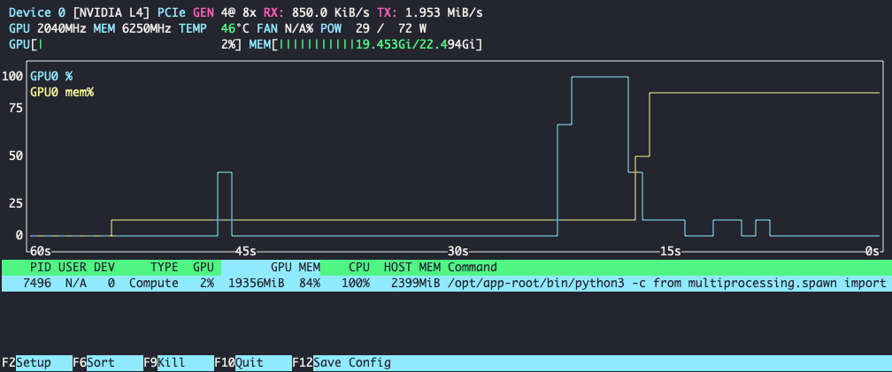

# Running Inference Server on RHEL AI

## Reference Specs

- RHEL AI Version: `1.3`
- EC2 Instance: `g6.xlarge` (you may want a larger instance for larger model support)
- RH Validated Model: [RedHatAI/Llama-3.2-1B-Instruct-FP8](https://huggingface.co/RedHatAI/Llama-3.2-1B-Instruct-FP8)
- Accelerator: `NVIDIA L4`
- Red Hat Inference Engine Image: `registry.redhat.io/rhaiis/vllm-cuda-rhel9:3.0.0`

## Procedures

TODO: Hugging Face Token

1. From the RHEL AI terminal, use podman to log into the registry `registry.redhat.io` with Red Hat account credentials to gain access to the Inference Engine

```bash
podman login registry.redhat.io
```

2. Use Podman to pull the NVIDIA-based inference engine from `registry.redhat.io`

```bash
podman pull registry.redhat.io/rhaiis/vllm-cuda-rhel9:3.0.0.0
```

3. Use Podman to run the inference server with the above-specified model

```bash
podman run --rm -it \
  --device nvidia.com/gpu=all \
  --security-opt=label=disable \
  --shm-size=4GB \
  -p 8000:8000 \
  --env "HUGGING_FACE_HUB_TOKEN=$HF_TOKEN" \
  --env "HF_HUB_OFFLINE=0" \
  --env VLLM_NO_USAGE_STATS=1 \
  registry.redhat.io/rhaiis/vllm-cuda-rhel9:3.0.0 \
  --model  RedHatAI/Llama-3.2-1B-Instruct-FP8 \
  --trust-remote-code
```
4. Wait to see the messages:

```bash
INFO 06-10 23:06:24 [launcher.py:34] Route: /invocations, Methods: POST
INFO:     Started server process [1]
INFO:     Waiting for application startup.
INFO:     Application startup complete.
```

*Note*: You can experiment with other Red Hat-validated models found on [huggingface.co/RedHatAI](https://huggingface.co/RedHatAI), but you may need a larger instance. `RedHatAI/Llama-3.2-1B-Instruct-FP8` is an LLM that will run on this instance without overconsuming GPU resources.

4. While running you can open up another terminal to monitor GPU utilization by running the command `nvtop`

Example output:



5. Open up a third terminal to test the running inference server with`curl` 

```bash
curl -X POST http://localhost:8000/v1/chat/completions   -H "Content-Type: application/json"   -d '{
    "messages": [
      {"role": "system", "content": "You are a helpful assistant."},
      {"role": "user", "content": "What is LLM inference"}
    ],
    "max_tokens": 500,
    "temperature": 0.3
  }' | jq

```

Example output:
```json
{
  "id": "chatcmpl-4ec6677aec2c4e4e874378fb07987435",
  "object": "chat.completion",
  "created": 1749598093,
  "model": "RedHatAI/Llama-3.2-1B-Instruct-FP8",
  "choices": [
    {
      "index": 0,
      "message": {
        "role": "assistant",
        "reasoning_content": null,
        "content": "LLM Inference is a process in natural language processing (NLP) that involves generating human-like text based on a given input, such as a prompt or a question. It's a key component of large language models (LLMs) like BERT, RoBERTa, and others.\n\nHere's a simplified overview of how LLM inference works:\n\n**What is a Large Language Model (LLM)?**\n\nA Large Language Model (LLM) is a type of artificial intelligence (AI) model that's trained on a massive dataset of text. ...",
        "tool_calls": []
      },
      "logprobs": null,
      "finish_reason": "length",
      "stop_reason": null
    }
  ],
  "usage": {
    "prompt_tokens": 47,
    "total_tokens": 547,
    "completion_tokens": 500,
    "prompt_tokens_details": null
  },
  "prompt_logprobs": null
}
```

6. Experiment with parameters such as:
```json
  "max_tokens" 
  "temperature"
```

*Note*  
  
  The larger the value for `max_tokens`, the more complete the response you will receive.   
   
The larger the value of `temperature`, the more creative liberty and less accuracy in the response.   

set the temperature between `0.0` and `1.0`
  
7. Observe inference performance with `nvtop` and output from inference server.

Example inference server output:
```log
INFO 06-10 23:35:35 [logger.py:39] Received request chatcmpl-d220fcd41bfd42c2995db5cd34ce4427: prompt: '<|begin_of_text|><|start_header_id|>system<|end_header_id|>\n\nCutting Knowledge Date: December 2023\nToday Date: 10 Jun 2025\n\nYou are a helpul assistant.<|eot_id|><|start_header_id|>user<|end_header_id|>\n\nWhat is LLM inference<|eot_id|><|start_header_id|>assistant<|end_header_id|>\n\n', params: SamplingParams(n=1, presence_penalty=0.0, frequency_penalty=0.0, repetition_penalty=1.0, temperature=0.3, top_p=0.9, top_k=-1, min_p=0.0, seed=None, stop=[], stop_token_ids=[], bad_words=[], include_stop_str_in_output=False, ignore_eos=False, max_tokens=500, min_tokens=0, logprobs=None, prompt_logprobs=None, skip_special_tokens=True, spaces_between_special_tokens=True, truncate_prompt_tokens=None, guided_decoding=None, extra_args=None), prompt_token_ids: None, lora_request: None, prompt_adapter_request: None.
INFO 06-10 23:35:35 [async_llm.py:228] Added request chatcmpl-d220fcd41bfd42c2995db5cd34ce4427.
INFO:     10.0.2.100:52206 - "POST /v1/chat/completions HTTP/1.1" 200 OK
INFO 06-10 23:35:44 [loggers.py:87] Engine 000: Avg prompt throughput: 4.7 tokens/s, Avg generation throughput: 50.0 tokens/s, Running: 0 reqs, Waiting: 0 reqs, GPU KV cache usage: 0.0%, Prefix cache hit rate: 50.0%

```

[Back to main README](./README.md)
