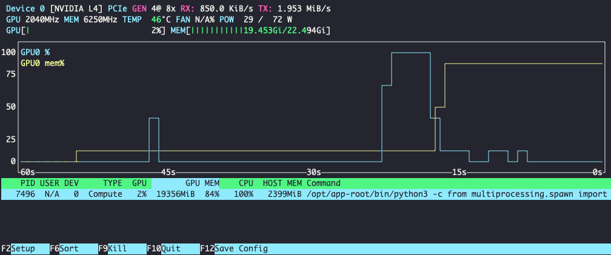

# Running Inferece Server on OpenShift

## Reference Specs
- OpenShift version: ` 4.18.16`
- Number of worker nodes: `2`
- EC2 instance of worker nodes: `g6.4xlarge`
- RH Validated Model: [RedHatAI/Llama-3.2-1B-Instruct-FP8](https://huggingface.co/RedHatAI/Llama-3.2-1B-Instruct-FP8)
- Accelerator: `NVIDIA L4`
- Red Hat Inference Engine Image: `registry.redhat.io/rhaiis/vllm-cuda-rhel9:3.0.0`
- RHDP Environment: [RHOAI on OCP on AWS with NVIDIA GPUs](https://catalog.demo.redhat.com/catalog?item=babylon-catalog-prod/sandboxes-gpte.ocp4-demo-rhods-nvidia-gpu-aws.prod&utm_source=webapp&utm_medium=share-link)

## Procedures

1. Create Project

```bash
oc new-project rhaiis
```

2. Create Secrets in project `rhaiis`: 
    - Pull Secret
        - Secret Name: `redhat-pull-secret`
        - Registry server address `registry.redhat.io`
    - key/val for Hugging Face User Access Tokens (obtained from Hugging Face profile)
        - Name: `huggingface-secret`
        - Key: `HUGGING_FACE_HUB_TOKEN`
        - Value: `<your token>`

3. Deploy with oc command

```bash
oc apply -k k8/rhaiis-deployment/base -n rhaiis    
```

Output:

```bash
service/vllm created
deployment.apps/vllm created
route.route.openshift.io/vllm created
```

4. Monitor pod logs

Wait to see the output:
```log
INFO: Started server process [1]
INFO: Waiting for application startup.
INFO: Application startup complete.
```

*Note*: This could take ~2 minutes before the inferece server is ready for requests

5. Obtain export route to environment variable

```bash
export ENDPOINT=https://$(oc get route vllm -n rhaiis --template='{{.spec.host}}{{if .spec.path}}{{.spec.path}}{{end}}{{"\n"}}')
```

6. Test the running inference server with `curl`

```bash
curl -X POST $ENDPOINT/v1/chat/completions   -H "Content-Type: application/json"   -d '{
    "messages": [
      {"role": "system", "content": "You are a helpful assistant."},
      {"role": "user", "content": "What is LLM inference"}
    ],
    "max_tokens": 500,
    "temperature": 0.3
  }' | jq
```

Example output:
```json
{
  "id": "chatcmpl-4ec6677aec2c4e4e874378fb07987435",
  "object": "chat.completion",
  "created": 1749598093,
  "model": "RedHatAI/Llama-3.2-1B-Instruct-FP8",
  "choices": [
    {
      "index": 0,
      "message": {
        "role": "assistant",
        "reasoning_content": null,
        "content": "LLM Inference is a process in natural language processing (NLP) that involves generating human-like text based on a given input, such as a prompt or a question. It's a key component of large language models (LLMs) like BERT, RoBERTa, and others.\n\nHere's a simplified overview of how LLM inference works:\n\n**What is a Large Language Model (LLM)?**\n\nA Large Language Model (LLM) is a type of artificial intelligence (AI) model that's trained on a massive dataset of text. ...",
        "tool_calls": []
      },
      "logprobs": null,
      "finish_reason": "length",
      "stop_reason": null
    }
  ],
  "usage": {
    "prompt_tokens": 47,
    "total_tokens": 547,
    "completion_tokens": 500,
    "prompt_tokens_details": null
  },
  "prompt_logprobs": null
}
```

6. Experiment with parameters such as:
```json
  "max_tokens" 
  "temperature"
```

*Note*  
  
  The larger the value for `max_tokens`, the more complete the response you will receive.   
   
The larger the value of `temperature`, the more creative liberty and less accuracy in the response.   

set the temperature between `0.0` and `1.0`
  
7. Observe inference logs from container

Example inference server output:
```log
INFO 06-10 23:35:35 [logger.py:39] Received request chatcmpl-d220fcd41bfd42c2995db5cd34ce4427: prompt: '<|begin_of_text|><|start_header_id|>system<|end_header_id|>\n\nCutting Knowledge Date: December 2023\nToday Date: 10 Jun 2025\n\nYou are a helpul assistant.<|eot_id|><|start_header_id|>user<|end_header_id|>\n\nWhat is LLM inference<|eot_id|><|start_header_id|>assistant<|end_header_id|>\n\n', params: SamplingParams(n=1, presence_penalty=0.0, frequency_penalty=0.0, repetition_penalty=1.0, temperature=0.3, top_p=0.9, top_k=-1, min_p=0.0, seed=None, stop=[], stop_token_ids=[], bad_words=[], include_stop_str_in_output=False, ignore_eos=False, max_tokens=500, min_tokens=0, logprobs=None, prompt_logprobs=None, skip_special_tokens=True, spaces_between_special_tokens=True, truncate_prompt_tokens=None, guided_decoding=None, extra_args=None), prompt_token_ids: None, lora_request: None, prompt_adapter_request: None.
INFO 06-10 23:35:35 [async_llm.py:228] Added request chatcmpl-d220fcd41bfd42c2995db5cd34ce4427.
INFO:     10.0.2.100:52206 - "POST /v1/chat/completions HTTP/1.1" 200 OK
INFO 06-10 23:35:44 [loggers.py:87] Engine 000: Avg prompt throughput: 4.7 tokens/s, Avg generation throughput: 50.0 tokens/s, Running: 0 reqs, Waiting: 0 reqs, GPU KV cache usage: 0.0%, Prefix cache hit rate: 50.0%

```
8. While running you can open up another terminal to monitor GPU utilization by running the command `nvtop` from the running pod.

- `rsh` into the pod

```bash
oc rsh deployment/vllm
```

- run `nvtop` from inside the pod

Example:

```bash
sh-5.1$ nvtop
```
Example output:


## Optional

### Test access from another pod using internal services

```bash
oc run testpod -it --rm --image=nicolaka/netshoot --restart=Never -n rhaiis -- bash
```
*Note*: `nicolaka/netshoot` is a networking trouble-shooting Swiss-Army Container

from the prompt:


```bash
curl -X POST vllm.rhaiis.svc.cluster.local:8000/v1/chat/completions   -H "Content-Type: application/json"   -d '{
    "messages": [
      {"role": "system", "content": "You are a helpful assistant."},
      {"role": "user", "content": "What is LLM inference"}
    ],
    "max_tokens": 500,
    "temperature": 0.3
  }' | jq
```

### Deploy Open WebUI and connect to the running RH Inference Server

```bash
oc apply -f k8/open-web-ui/ -n rhaiis
```

Once deployed, get the Open WebUI route:

```bash
oc get routes open-webui  
```

Example output:
```bash
NAME         HOST/PORT
open-webui   open-webui-rhaiis.apps.<your-domain>
```


[Back to main README](./README.md)